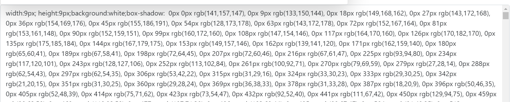

#  Image2BoxShadow
Saw someone make a Mona Lisa with CSS Boxshadow, so now here a generator for images. So here it is, because its fun and  its possible.

Example with 4 pixels.


Example with 9 pixels.


Css returned

<br>
<br>
<hr>
<br>

## Quick Setup
1. Clone the repo
2. Open the terminal and type
```bash
 cd image2boxshadow 
```
3. Copy the `.env.example` file and rename it to `.env`, then fill in the correct configurations. 
4. Install the composer dependencies
```bash
 composer install
```
5. Run the application with:
```bash
 php artisan serve 
```
6. Goto http://127.0.0.1:8000 and have fun!


<br><br></hr>
I'm not responsible for your chrome that crashes when editing the CSS in element inspect, whuahah!!! GL & HF!